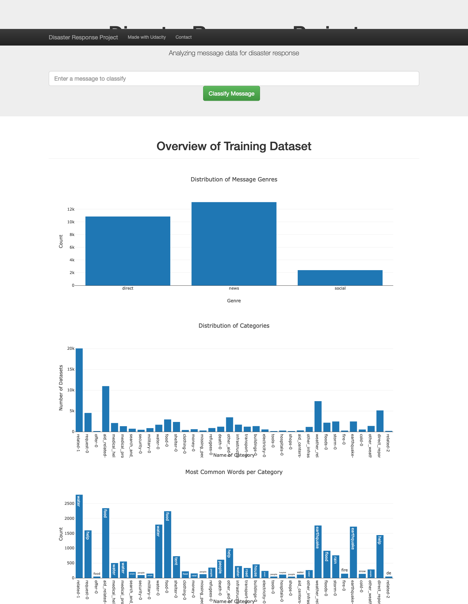

# Disaster_Response_Pipeline
This repository contains the code for a disaster response app, a project for my Udacity data science course.
Objective is to write an interactive web-app that allows the classification of messages into different categories
e.g. request for aid, medical help etc. A pre labeled data set from FigureEight is utilized as training data, for 
the following data processing steps:

- Data preprocessing (Extract Transform Load)
    - Extraction of data from csv, transformation usable tabular form, loading into sql database
- Training and optimization of data machine learning pipeline
    - Data is loaded form sql database and divided into features and labels
    - Features (written text) is cleaned, tokenized, lemmatized and transformed into Tfidf representation
    - Length of the text message is used as an additional feature
    - Data is classified using a multi output Random Forrest Classifier
    - The whole data pipeline is optimized using a grid search, optimizing with respect to the number of decision trees for the classifier
    - The optimized pipeline is saves as a pickle
- Interactive web app displaying
    - Load database form sql
    - Displaying a summary of the database
    - Allow classification of user input

## File Description
    .
    +-- app     
    |   +-- run.py                   # flask web app
    |   +-- templates   
    |       +-- go.html              # Classification result
    |       +-- master.html          # Homepage    
    +-- data                   
    |   +-- disaster_categories.csv # Data set classification categories  
    |   +-- disaster_messages.csv   # Data set messages
    |    +-- process_data.py         # Extract Transform Load Data
    +-- models
    |   +-- train_classifier.py     # Train and save model classifier 
    +-- static  
    |   +-- Example.png             # Picture of example
    |   +-- Homepage.png            # Picture of Homepage
    +-- README.md                   # Readme
    +-- notebooks                   # Jupyter notebooks with old data
    |   +-- categories.csv
    |   +-- messages.csv
    |   +-- messages.db
    |   +-- ML Pipeline Preparation.ipynb
    |   +-- ETL Pipeline Preparation.ipynb
    

## Instructions to run the app:
1. Run the following commands in the project's root directory to set up your database and model.

    - To run ETL pipeline that cleans data and stores in database
        `python data/process_data.py data/disaster_messages.csv data/disaster_categories.csv data/DisasterResponse.db`
    - To run ML pipeline that trains classifier and saves
        `python models/train_classifier.py data/DisasterResponse.db models/classifier.pkl`

2. Run the following command in the app's directory to run your web app.
    `python run.py`

3. Go to http://0.0.0.0:3001/

## Results


### Example
Type: I need help!


# Installation 
```bash
pip install -r requirements.txt
```

## If you can want to run the file in a new enviroment:
- Make sure conda is installed (Best practice, set up with virtualenv is not tested)
- Open a terminal or a anaconda prompt
- If desired make new enviroment: conda create -n name_of_enviroment python
- Activate enviroment conda activate: conda create name_of_enviroment
- Install dependencies: pip install requirements.txt
- If the new enviroment / kernel is supposed to be used in Jupyter, install kernel:
```bash
    python -m ipykernel install --name name_of_enviroment
```
- Open your Jupyter Notebook it should work now


